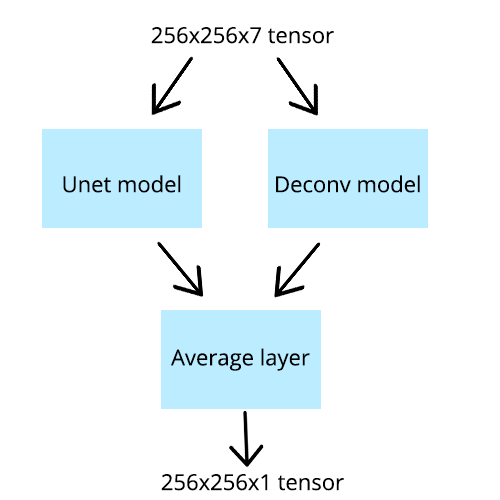
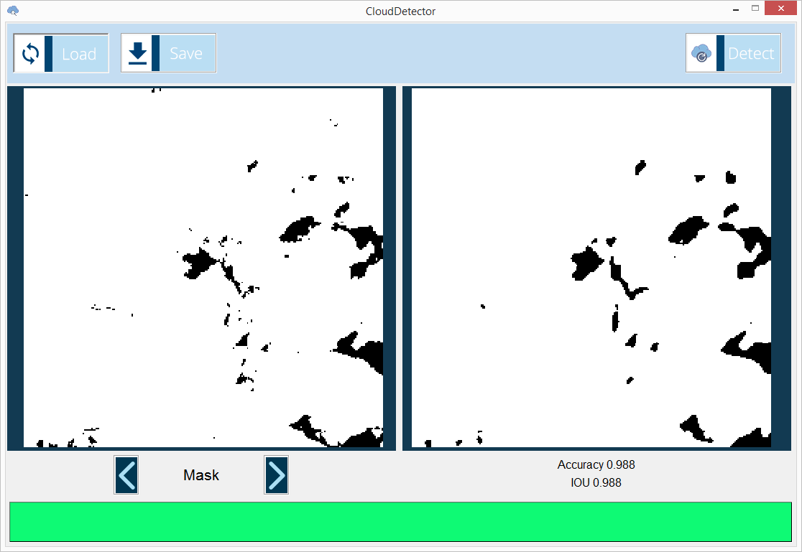

# Cloud Segmentation with Unet

This repository contains my coursework as 2nd year BSc in HSE. The objective was to create an app for cloud segmentation using 7 bands of Landsat 8 satellite. The proposed solution takes as input first 7 bands from the Landsat 8 and builds a segmentation mask, using a blend of Unet and DeconvNet architectures.

Using the app you can visualize masks, from any zip file in `val/` directory.
Here is how the visualized mask will look like:

## Instructions
1. Clone the repo and run `pip -r install requirements.txt`
2. Run the app with `python CloudDetector.py`
3. Choose any file from `val/` in the app and click 'Detect' button to check the result
